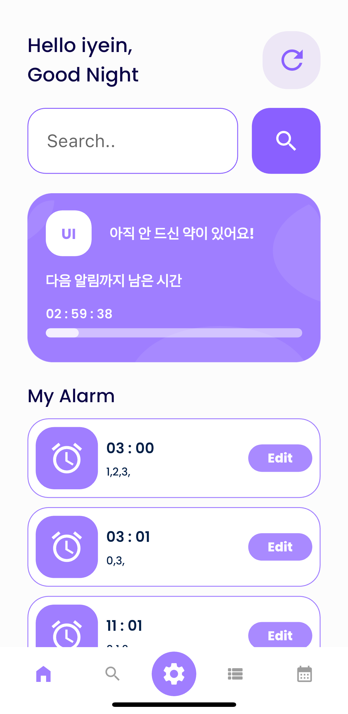
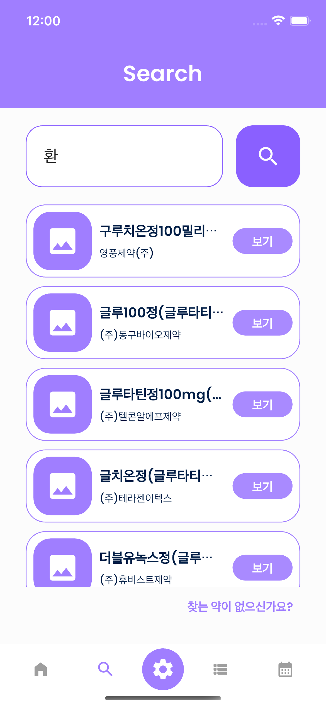
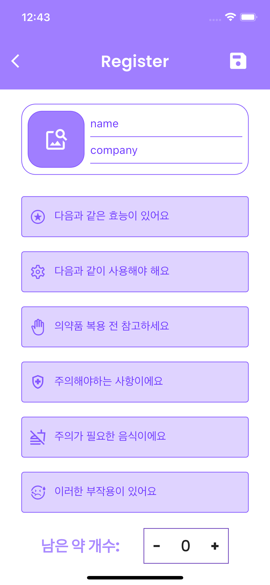
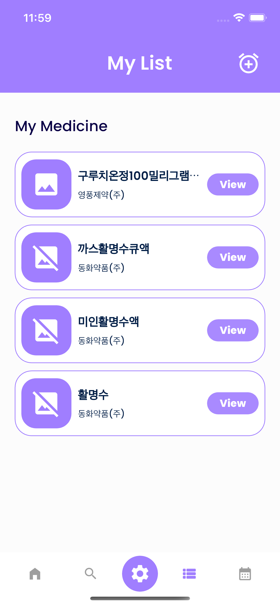
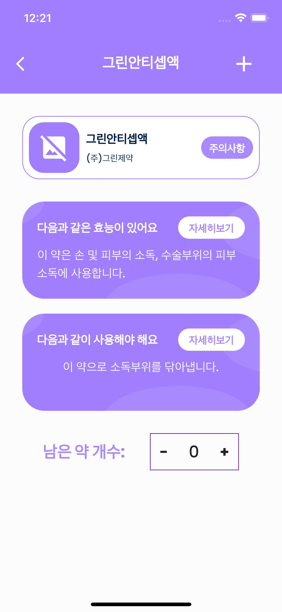
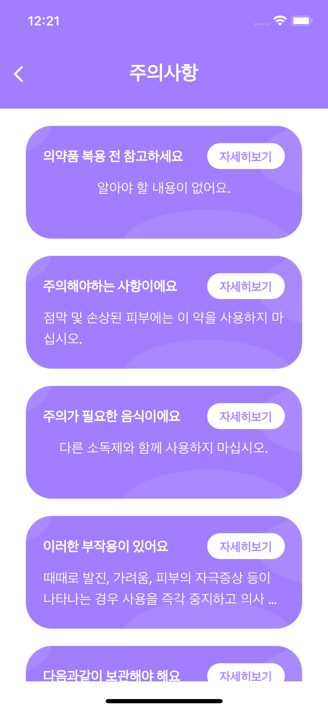
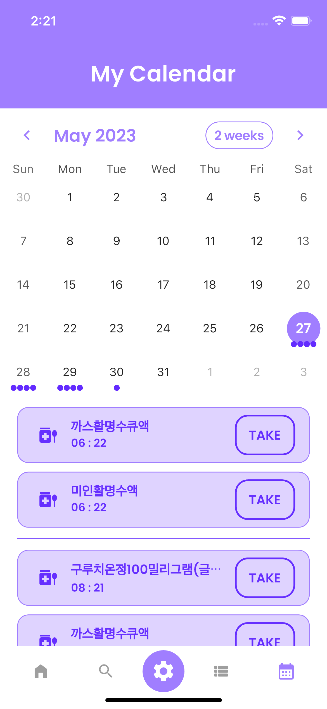

# 정약용[Prototype] - 정확한 약 복용

   
  
   

## 프로젝트 소개

프로토타입 소개영상

 

## Tech Stack

 

## PAGES

### HomePage

### Search or Register

&nbsp;&nbsp;&nbsp;

### ListPage, Medicines Information

&nbsp;&nbsp;&nbsp;&nbsp;&nbsp;&nbsp;

### CalendarPage

 

<!-- Stack Icon Refernces -->

[flutter]: /image/flutter.svg
[aws]: /image/amazon-aws.svg
[firebase]: /image/firebase.svg