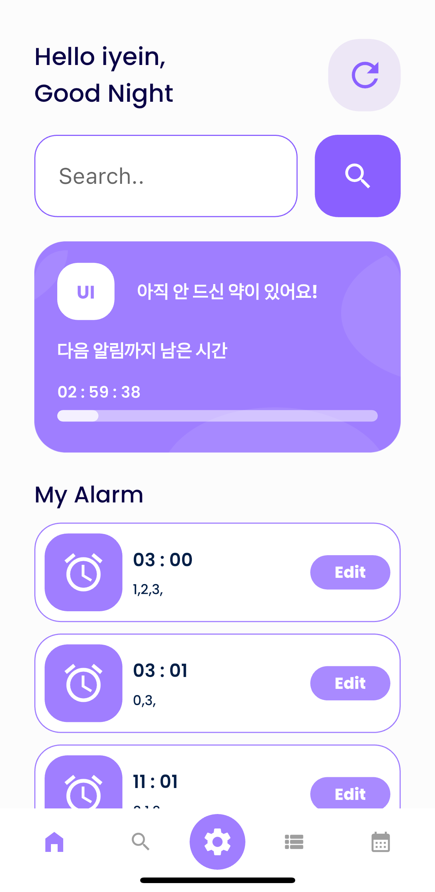

# 정약용

   
  
   

## 프로젝트 소개

프로젝트 개요/동기

GIF Images

 

## Tech Stack

 

## 구현 기능

### HomePage

### 기능 2

### 기능 3

### 기능 4

 

<!-- Stack Icon Refernces -->

[flutter]: /image/flutter.svg
[aws]: /image/amazon-aws.svg
[firebase]: /image/firebase.svg